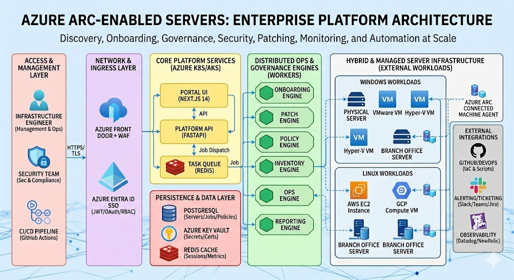
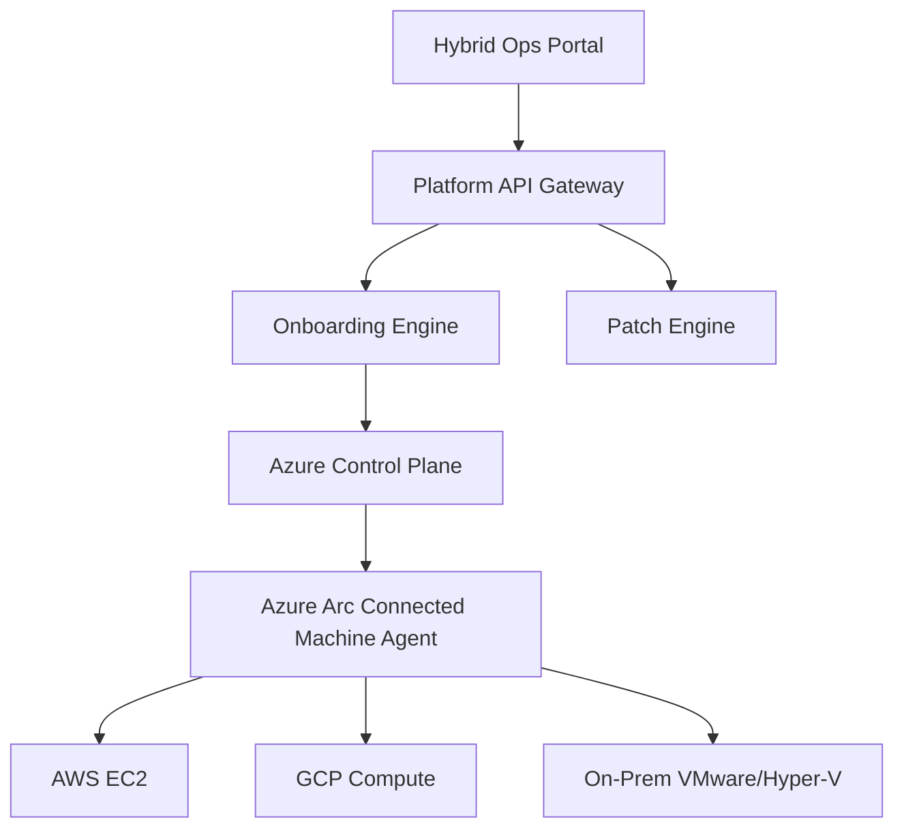
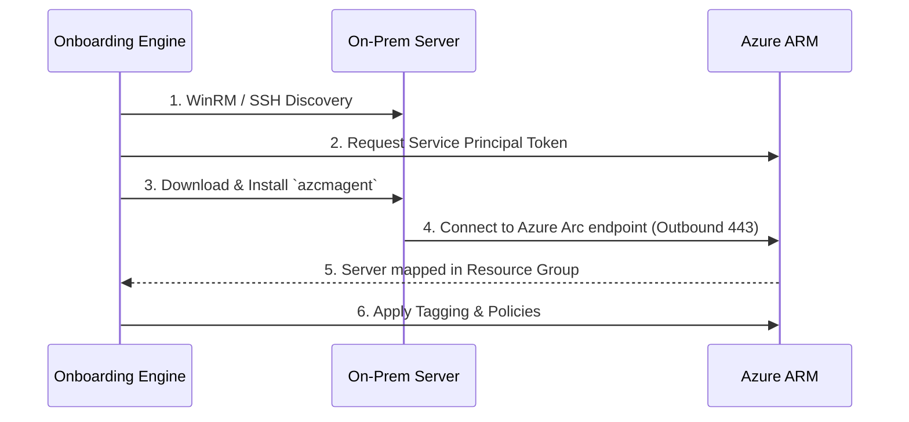
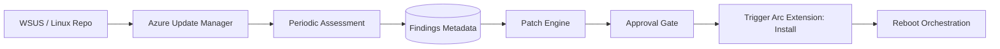
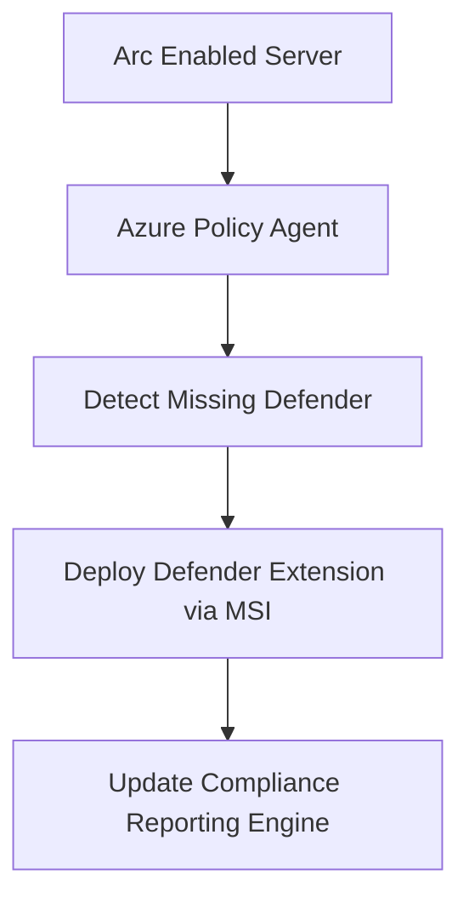
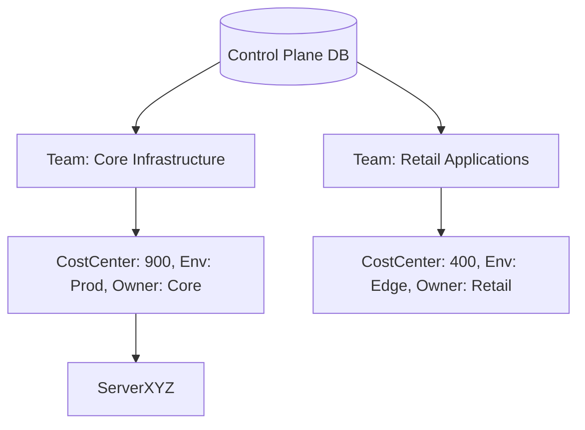
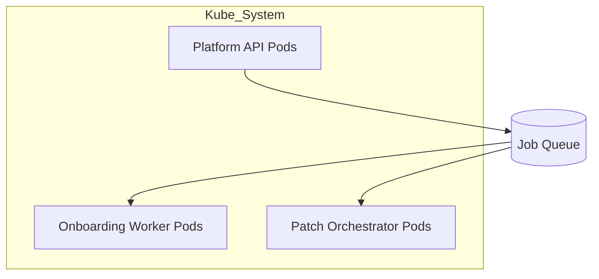
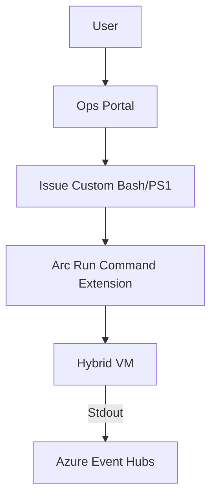
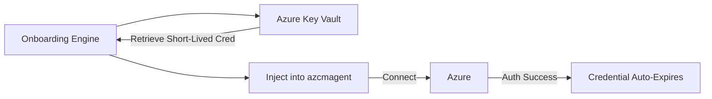

<div align="center">


<h1>Azure Arc-Enabled Servers Platform</h1>

<p><strong>Enterprise Control Plane for Hybrid, Multi-Cloud, and Edge Server Fleet Operations</strong></p>

[](https://devopstrio.co.uk/)
[](/terraform)
[](/apps/onboarding-engine)
[](https://devopstrio.co.uk/)

</div>

---

## 🏛️ Executive Summary



The **Azure Arc-Enabled Servers Platform** centralizes operations, governance, and security for hybrid server fleets scaling into the tens of thousands. By utilizing Azure Arc as the ultimate control plane, enterprises can manage AWS EC2 instances, on-premises VMware VMs, and branch-office Linux machines seamlessly alongside native Azure resources.

### Strategic Business Outcomes
- **Unified Patch Management**: Schedule, execute, and guarantee Update Management across Windows and Linux regardless of their physical network location.
- **Agentless Onboarding**: The background Discovy Engine sweeps corporate networks, deploying Connected Machine agents dynamically to orphaned IT assets.
- **Policy Enforcement**: Push Azure Policy (Defender configs, log analytics extensions) instantly to thousands of non-Azure machines.
- **Single Pane of Glass**: A central dashboard combining performance metrics, security alerts, and missing patch inventories.

---

## 🏗️ Technical Architecture Details

### 1. High-Level Architecture


### 2. Arc Agent Onboarding Workflow


### 3. Patch Lifecycle Flow


### 4. Policy Compliance Integration


### 5. Multi-Tenant Tagging Model


### 6. Security Trust Boundary
```mermaid
graph TD
    Agent[azcmagent (Hybrid Server)] -->|Outbound 443 / TLS 1.2| ArcLink[Azure Arc Gateway]
    ArcLink --> Entra[Entra ID Authentication]
    Entra --> ARM[Azure Resource Manager]
    note left of Agent: No inbound ports required on firewalls
```

### 7. AKS Operations Topology


### 8. Analytics & Monitoring Flow
```mermaid
graph TD
    Agent[Azure Monitor Agent (AMA)] --> Log[Azure Log Analytics Workspace]
    Log --> Alert[Azure Monitor Alerts]
    Log --> Grafana[Security Posture Dashboards]
    Alert --> Hook[ServiceNow Webhook]
```

### 9. Operations Automation (Ops Engine)


### 10. Service Principal Zero-Trust Rollout


---

## 🛠️ Global Platform Engines

| Engine | Directory | Purpose |
|:---|:---|:---|
| **Portal UI** | `apps/portal/` | The Next.js unified command center for fleet operations. |
| **Platform API** | `backend/src/` | Centralized router managing asynchronous Arc jobs. |
| **Onboarding Engine**| `apps/onboarding-engine/`| Automates the network-wide discovery and silent installation of `azcmagent`. |
| **Patch Engine** | `apps/patch-engine/` | Interacts with Azure Update Manager to orchestrate bulk patching rings. |
| **Inventory Engine** | `apps/inventory-engine/`| Syncs hardware, OS, and software signatures derived from Guest Configurations. |

---

## 🚀 Environment Bootstrapping

Deploy the foundation infrastructure to establish the Arc Operations hub.

```bash
cd bicep
az deployment sub create --name arc-platform --location uksouth --template-file main.bicep
```

---
<sub>&copy; 2026 Devopstrio &mdash; Mastering the Hybrid Datacenter.</sub>
